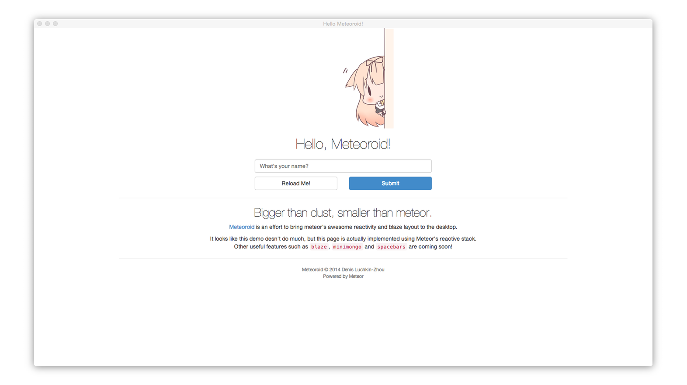

# Meteoroid

*Bigger than dust, smaller than meteor.*
[Meteor][1] flavored [Atom Shell][2]. Or [Atom Shell][2] flavored [Meteor][1].

This project attempts to create a version of [Meteor][1] for development of desktop applications. More specifically, I am trying to incorporate the most essential features of the Meteor into the [Atom Shell][2]. I plan to support most of the client side features of the Meteor, inclusing reactivity, minimongo, blaze and spacebars.

At this point this project is still proof of concept work, and everything is subject to drastic change. With that being said, reactivity and minimongo seem to work as intended, while I am actively working on porting blaze and spacebars.

**Note:** This is not a Meteor compatible framework! Copy-pasted Meteor apps are very unlikely to work without modification. That being said, I will do my best to ensure that client-side development remains consistent with the Meteor.

## Differences from Meteor

First of all, Meteoroid is a client-only framework, meaning that it will have no DDP or RPC support (unless your application needs to interface with such endpoints). Server-side code will **not** work here.

Meteoroid will use its own Grunt.js based build system. It will be based on the Meteor's build system, but expect a few differences. Therefore, there will be no support for atmosphere packages, though most of them can be converted into Meteoroid modules very easily.

## Directory Structure
 - `app`: Boilerplate app for testing purposes
 - `build`: Gruntfile and build scripts
 - `modules`: Meteoroid modules

## Building the Meteoroid
1. Clone the project: `$ git clone https://github.com/jluchiji/meteoroid`
2. `cd` to `build`
3. Install Grunt.js: `$ npm install`
4. Download dependencies: `$ grunt bootstrap`
5. Build demo app: `$ grunt build`
6. Run demo app: `$ grunt run`

[1]: https://github.com/meteor/meteor
[2]: https://github.com/atom/atom-shell
